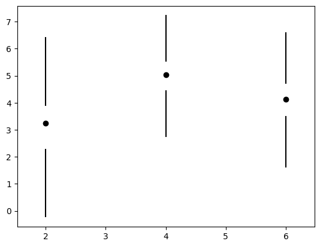

# `minimalboxplot`

Create a minimal boxplot a la Tufte (2001) p. 125.

The "box" extends from the first quartile (Q1) to the third quartile (Q3) of the data, with a dot at the median. The whiskers extend from the box to the farthest data point lying within 1.5x the inter-quartile range (IQR) from the box. The plot maximizes the data to ink ratio.

```

|   Q1-1.5IQR 
|
|
|
|   Q1


.   median

|   Q3
|
|
|    Q3+1.5IQR
```

## Installation

Install via `pip`

```bash
python3 -m pip install git+https://github.com/w-decker/minimalboxplot.git
```

## Usage

### `MinimalBoxPlot.minimal()`

Generate minimal boxplot.

```py
import matplotlib.pyplot as plt
import numpy as np
import minimalboxplot as mbp

# make data:
np.random.seed(10)
D = np.random.normal((3, 5, 4), (1.25, 1.00, 1.25), (100, 3))

# fig, ax
fig, ax = plt.subplots()

# plot
mbp.MinimalBoxPlot.minimal(ax=ax, x=D, positions=[2, 4, 6], width=1.5, color='C5')
```

### `MinimalBoxPlot.to_minimal()`

Convert existing box plot to minimal boxplot.

```py
import matplotlib.pyplot as plt
import numpy as np
import minimalboxplot as mbp

# make data:
np.random.seed(10)
D = np.random.normal((3, 5, 4), (1.25, 1.00, 1.25), (100, 3))

# plot
fig, ax = plt.subplots()
VP = ax.boxplot(D, positions=[4, 5, 7], widths=1.5, patch_artist=True,
                showmeans=False, showfliers=False,
                medianprops={"color": "white", "linewidth": 0.5},
                boxprops={"facecolor": "C0", "edgecolor": "white",
                          "linewidth": 0.5},
                whiskerprops={"color": "C0", "linewidth": 1.5},
                capprops={"color": "C0", "linewidth": 1.5})

# convert plot to minimal boxplot
new = mbp.MinimalBoxPlot.to_minimal(fig, VP)
```

## Example boxplot



## Usage
[LICENSE](LICENSE)